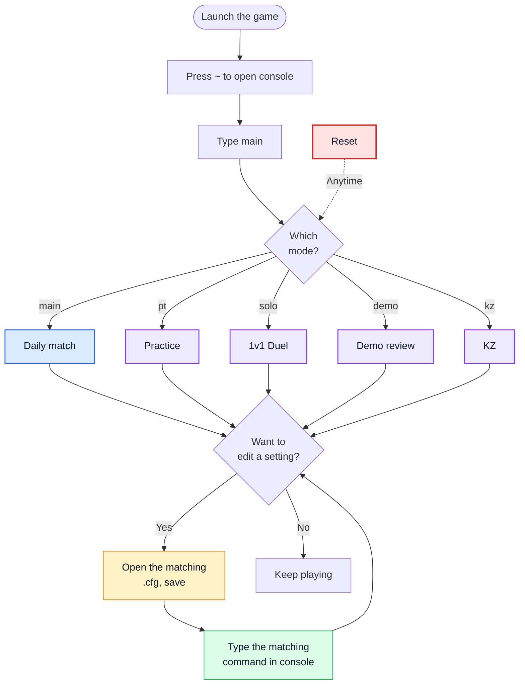

<div align="center">

**English** | [中文](README.md)

  #  CS2 CFG Preset
  ### A modular, file-centric CS2 config preset

[](https://github.com/chayu163/cs2-cfg)


</div>

A curated `.cfg` preset covering **daily match, practice, 1v1 duels, demo review, and KZ** — built around a "file-centric" design: one folder holds your whole setup, freely try binds in the console, roll back with a single command.

---

##  

-  Every category of setting lives in its own `.cfg` (mouse, crosshair, binds, buy menu…). To tweak anything, just open one file.
-  Mess around in the in-game console all you want — type `main` to roll back to the file-source config. Nothing is permanent.
-  Mode cfgs are independent — switching one overwrites the current binds and params, so each mode gets a full keymap.
-  Every mode prints an ASCII-art title + a two-column command/keymap cheat sheet on load. No external tools needed.

---

##  

1. **Locate the folder**: Steam → right-click CS2 → Manage → Browse local files → enter `game\csgo\`.

2. **Apply the preset**: Copy the `cfg/` directory of this repo into `game\csgo\cfg\` (you don't need `assets/`, `site/`, or the root README files).

3. **Set the recommended launch options**: Steam → right-click CS2 → Properties → General → Launch options:

   

   ```shell
   -promptperfectworld -coop_fullscreen -nojoy -novid -tickrate 128 +exec config/main.cfg -disable_workshop_command_filtering
   ```

   

4. **Launch the game**, press `~` and type `main` — you should see the `Main CFG 加载成功!` banner.

> Heads-up: the in-game banner text and the help menus (`pt_help`, `solo_help`, etc.) are in Chinese. The README is bilingual — feel free to translate those `.cfg` files yourself if needed.

---

##  



**Reset (red arrow)**: to switch modes, first type `main` to roll back to the baseline, then load the new mode — this prevents keybinds from different modes mixing.

---

## 

```
.
├── README.md / README.en.md            # Bilingual README (Chinese is the default entry)
├── LICENSE                              # GPL-3.0 license
├── mise.toml                           # mise runtime config: node = "22.23.1"
├── assets/                             # Static assets (architecture diagram, keymap)
├── cfg/                                # Game config (copy into game\csgo\cfg\)
├── docs/                               # Design docs & implementation plans (superpowers specs/plans)
└── site/                               # Standalone React + Vite welcome/doc site (not loaded by CS2)
    ├── index.html
    ├── package.json
    ├── package-lock.json
    ├── vite.config.js
    └── src/
        ├── App.jsx
        ├── main.jsx
        ├── styles.css
        └── assets/
```

The detailed `cfg/` layout is shown below:

```
cfg/
├── autoexec.cfg                       # Entry: defines global aliases, then exec config/main
└── config/
    ├── main.cfg                       # Base preset: single load manifest (settings → shared → binds → VNL) + menu output
    ├── shared.cfg                     # Cross-mode shared aliases
    │
    │  ── Subfolders loaded permanently by main ──
    │
    ├── settings/                      # Permanent settings (load order decided by main.cfg)
    │   ├── network.cfg                # Network / frame data
    │   ├── mouse.cfg                  # Mouse sensitivity
    │   ├── crosshair_viewmodel.cfg    # Crosshair / viewmodel
    │   ├── video.cfg                  # Brightness
    │   ├── basic.cfg                  # Console, FPS and other basics
    │   ├── audio.cfg                  # Volume / headphone EQ
    │   └── hud.cfg                    # Radar / HUD scale
    │
    ├── binds/                         # Bind layer
    │   ├── keys.cfg                   # General key binds
    │   ├── buy.cfg                    # Quick buy
    │   ├── utility.cfg                # Utility binds (jump-throw, double-key jump…)
    │   └── loaders.cfg                # Switch aliases for main/pt/solo/demo/kz
    │
    │  ── Scenario modes (overlay main; reset with main before switching) ──
    │
    ├── modes/                         # All mode cfgs
    │   ├── pt.cfg / pt_knife.cfg      # Practice
    │   ├── solo.cfg                   # 1v1 Duel
    │   ├── demo.cfg                   # Demo review
    │   ├── kz.cfg                     # KZ mode
    │   └── pt_help.cfg / solo_help.cfg # pt/solo help
    │
    └── VNL/                           # VNL binds (KZ / movement tech)
        ├── README.md                  # Maintenance principles
        ├── movement.cfg               # Shared A/D movement base aliases
        ├── cj.cfg / cja.cfg / cjd.cfg  # CJ bunny hop (no/left/right strafe)
        ├── j.cfg / ja.cfg / jd.cfg    # Plain jump (no/left/right strafe)
        ├── jb.cfg                     # Wheel JumpBug
        └── deprecated/                # Deprecated / historical (not loaded)
```

<div align="center">
  
</div>

---

## 

`site/` is a standalone React 19 + Vite welcome and documentation site with bilingual Chinese/English support. It is not loaded by the game, and is developed, built, and deployed separately.

```bash
cd site
mise exec -- npm ci
mise exec -- npm run dev    # Local preview
mise exec -- npm run build  # Production build (outputs dist/)
```

---

## 

**`main` is the base mode** (used for daily matches; aggregates the `settings/` permanent configs, the `shared.cfg` aliases, the `binds/` key layers, and the VNL baseline). The other modes are overlay layers — pick one to load on top.

**Scenario modes** (overlay `main`):

| Command             | Scenario | Description                                              |
| ------------------- | -------- | -------------------------------------------------------- |
| `pt` / `pt_help`    | Practice | `sv_cheats`, infinite ammo, trajectory, bots, refill…   |
| `solo` / `solo_help`| 1v1      | Weapon aliases (`ak` / `awp` / `usp` / …)                |
| `demo`              | Demo     | demoui, playback-speed gears, recording presets…         |
| `kz`                | KZ       | Checkpoints / timer / replay / NVGs…                     |

**VNL movement** (for ranked / KZ; defaults to `MWHEELDOWN` trigger):

| Command             | Description                                          |
| ------------------- | ---------------------------------------------------- |
| `cj` / `cja` / `cjd`| -w CJ bunny hop (no/left/right strafe)               |
| `j` / `ja` / `jd`   | -w J plain jump (no/left/right strafe)               |
| `jb`                | Wheel JumpBug                                        |
| `vnltest`           | Load the test stub                                   |

**Hotkeys**: `Insert` = load `main` / `Delete` = load `pt`.

---

##  

### Edit parameters

| What                | File                                 |
| ------------------- | ------------------------------------ |
| Mouse sensitivity   | `config/settings/mouse.cfg`               |
| Crosshair / viewmodel | `config/settings/crosshair_viewmodel.cfg` |
| Volume / EQ         | `config/settings/audio.cfg`               |
| Radar / HUD scale   | `config/settings/hud.cfg`                 |
| Buy binds           | `config/binds/buy.cfg`                    |
| General binds       | `config/binds/keys.cfg`                   |
| Practice            | `config/modes/pt.cfg`                     |
| 1v1                 | `config/modes/solo.cfg` (append `alias`)  |
| Demo                | `gear_*` aliases in `config/modes/demo.cfg` |
| KZ                  | `config/modes/kz.cfg`                     |
| VNL                 | `config/VNL/*.cfg` (see `config/VNL/README.md`) |

**After editing, type `main` in the console to reload, and update the matching help when applicable (e.g. `pt` / `pt_help`).**

### Enable commented-out features

A few settings live behind `//` comments. Delete the leading `//` to enable.

Examples: jump-throw, double-key bunny hop, nade crosshair, quick bomb drop — all live in `config/binds/utility.cfg`.

### Add a new mode

1. Create a new `.cfg` under `cfg/config/modes/` (mirror the structure of `pt.cfg`).
2. Add the command alias in `config/binds/loaders.cfg`: `alias <name> "exec config/modes/<name>"`.
3. Echo it from the menu in `main.cfg`.
4. Update the keymap (`assets/键位图.png`) to keep it in sync.

> See the [Keymap](#keymap) at the bottom of the References section for the current layout.

---

##  

- [csdb.gg](https://csdb.gg/) — CS2 command reference
- [mbsifu.com CS2 Command Library](https://mbsifu.com/library/game/cs2/command) — Console command directory
- [config.upup.cool](https://config.upup.cool/v2/) — Buy-bind code generator
- [Purple-CSGO/CS2-Config-Presets](https://github.com/Purple-CSGO/CS2-Config-Presets) — Upstream preset

### Keymap

<div align="center">
  
</div>

---

##  

The repo uses an allowlist `.gitignore` and only tracks:

- `README.md` / `README.en.md`
- `LICENSE`
- `mise.toml`
- `assets/**`
- `cfg/autoexec.cfg` / `cfg/config/**`
- `docs/**` (design docs & implementation plans)
- `site/**` (excluding `site/node_modules/`, `site/dist/`)

Auto-generated `.cfg` files, demos, caches, and the site's dependencies/build output never enter version control. `cfg/config/VNL/deprecated/` is implicitly tracked via `**` and retained for historical reference.

```bash
git add . && git commit -m "describe the change" && git push
```

---

## 

This project is licensed under the [GNU General Public License v3.0](LICENSE).

Copyright © 2026 CS2 CFG Preset contributors

SPDX-License-Identifier: GPL-3.0-only

---

[English](README.en.md) | [中文](README.md)
