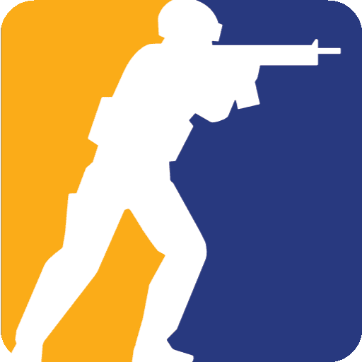

<div align="center">
   

  #  CS2 CFG Preset
  ### 🛠️ 个人自用配置方案
</div>

用于 **Counter-Strike 2** 的自用配置文件组合（CFG）。集合了日常匹配、跑图训练、单挑对战以及录像复盘的方案，且自带原生游戏内的**可视化控制台双栏排版菜单**。

> **Credits：** 
> 本配置包在此开源项目基础上进行二次精简与修改而来：[Purple-CSGO/CS2-Config-Presets](https://github.com/Purple-CSGO/CS2-Config-Presets) ，在此特别向原作者表示感谢。
>


---

## 📁 文件说明

| 文件名 | 描述 | 包含内容 |
| :--- | :--- | :--- |
| **`cfg\config\main.cfg`** | 主要配置 | 准星、优化参数、常用键位映射 |
| **`cfg\config\modules\*.cfg`** | 主要配置子模块 ||
| **`cfg\config\pt.cfg`** | 跑图练习 | 开启作弊、无限道具、轨迹显示 |
| **`cfg\config\solo.cfg`** | 单挑模式 | 武器库替换、发枪逻辑、热身设定 |
| **`cfg\config\demo.cfg`** | 录像复盘 | Demo 观战专用优化 |
| **`cfg\config\VNL\*.cfg`** | VNL binds | 官匹身法bind |
| **`cfg\config\*_help.cfg`** | UI 支持 | 自制控制台双列格式对齐菜单 |

---

## 🚀 安装及启用
1. 💡 **通用快捷路径**：打开 Steam 游戏库 -> 右键点击 `Counter-Strike 2` -> **管理** -> **浏览本地文件**。在弹出的目录中依次打开 `game\csgo` 文件夹。

2. 于`game\csgo` 目录下 Clone 本仓库。

3. 启动 Steam，右击 `Counter-Strike 2` -> **属性** -> **通用**。

5. 在底部的**启动选项**中添加以下指令：
   ```text
   -promptperfectworld -coop_fullscreen -nojoy -novid -tickrate 128 +exec config/main.cfg -disable_workshop_command_filtering
   
   -promptperfectworld  # 强制手动选择服务器
   -coop_fullscreen     # 全屏窗口化
   -nojoy               # 移除手柄支持
   -novid               # 跳过开场动画
   -tickrate 128        # 设置本地游戏采样速率128tick
   +exec config/main.cfg       # 执行主配置文件（必须）
   -disable_workshop_command_filtering  # 支持创意工坊地图执行cfg
   ```
   
6. 启动游戏

---

## ⌨️ 快速切换

在游戏内按下 `~` 呼出控制台，可以直接输入以下指令在各个模式间快速无缝切换：

| 输入指令 | 作用说明 |
| :--- | :--- |
| **`main`** | 切换至常规对战配置 |
| **`pt`**   | 切换至跑图练习模式 |
| **`pt_help`**   | 跑图练习模式帮助 |
| **`solo`** | 切换至单挑对决模式 |
| **`solo_help`** | 单挑对决模式帮助 |
| **`demo`** | 切换至看录像配置   |

------

## 🔄 更新与维护

本仓库采用 Git 管理，仅跟踪以下内容：

- `cfg/autoexec.cfg`
- `cfg/config/**`
- `assets/**`
- `README.md`

其余游戏自动生成的配置、录像、缓存等文件均不会提交。

### 日常更新流程

修改配置或新增文件后，在仓库根目录执行：

```bash
git status
git add .
git commit -m "描述本次修改"
git push
```

### 拉取最新配置

如果仓库已有新的提交，只需执行：

```bash
git pull
```

即可同步最新配置。

> **建议：** 每完成一项功能优化或配置调整后及时提交一次，便于回溯历史版本，也能避免误修改导致配置丢失。

---
> 📅 **最后更新:** 2026-08-13  
> 🏷 **备注:** 纯自用精简版本。移除了大量冗余。

### 收录一些资源站：

https://csdb.gg/

https://mbsifu.com/library/game/cs2/command	

### 附键位图：

<div align="center">
   
