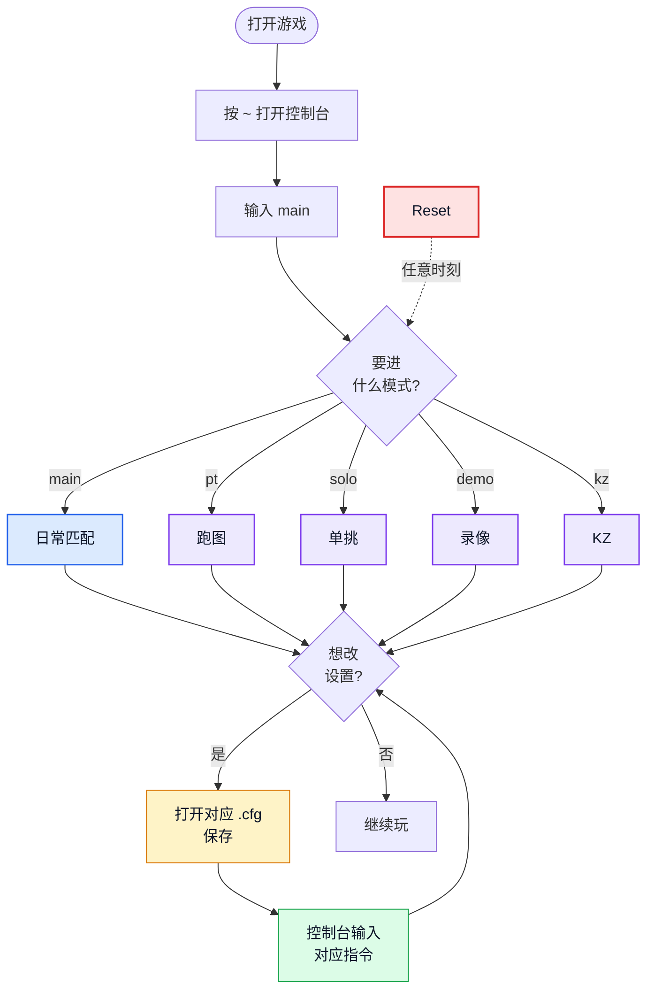
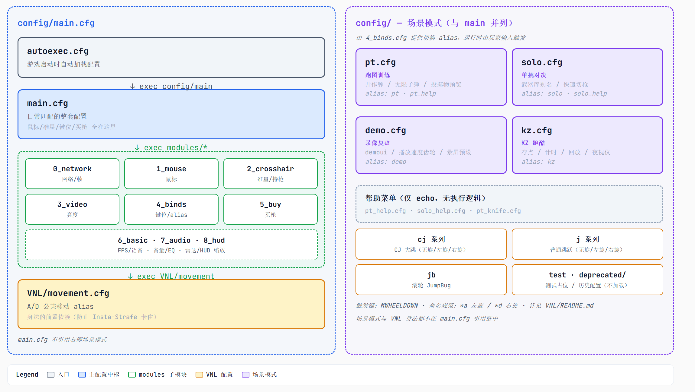
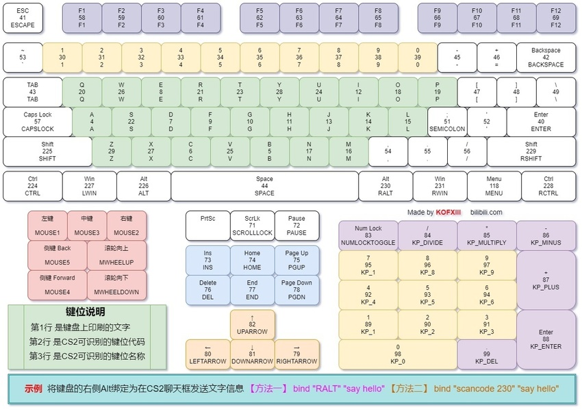

<div align="center">

  #  CS2 CFG Preset
  ### 一个模块化、以文件为中心的 CS2 配置方案

[](https://github.com/chayu/cs2-cfg)


</div>

[English](README.en.md) | **中文**

覆盖**日常匹配、跑图训练、单挑对决、录像复盘、KZ 跑酷**五种场景的 .cfg 配置合集，以"文件为中心"为核心设计——一个文件夹囊括个人配置，控制台随意尝试bind，一个命令回滚。

---

##  

-  每类设置独立成 .cfg（鼠标、准星、键位、买枪…），修改配置只需打开一个文件
-  游戏设置任意改，在控制台输入 `main`即可回滚到文件源配置， 改不怕坏
-  模式 cfg 互相独立，切换会覆盖当前键位和参数，每种模式下享有全套键位
-  每个模式加载后输出 ASCII 艺术标题 + 双栏指令/键位对照表，无需任何外部工具

---

##  

1. **定位目录**：Steam → 右键 CS2 → 管理 → 浏览本地文件 → 进入 `game\csgo\`

2. **应用配置**：将本仓库的 `cfg/` 目录内容复制到 `game\csgo\cfg\` 下（`assets/` 和根 `README.md` 不需要）

3. **设置推荐启动项**：Steam → 右键 CS2 → 属性 → 通用 → 启动选项：

   

   ```shell
   -promptperfectworld -coop_fullscreen -nojoy -novid -tickrate 128 +exec config/main.cfg -disable_workshop_command_filtering
   ```

   

4. **启动游戏**，按 `~`输入`main` 应能看到 `Main CFG 加载成功!` 标题

---

##  



**重置（红色卡）**：想换模式时，先 `main` 重置回基线，再切到新模式——避免各模式键位混用。

---

## 

```
cfg/
├── autoexec.cfg                       # 入口：定义全局 alias 后 exec config/main
└── config/
    ├── main.cfg                       # 基础配置：聚合 modules/* 与 VNL/movement
    │
    │  ── 场景模式（覆盖 main，切换前先 main 重置） ──
    │
    ├── pt.cfg / pt_knife.cfg          # 跑图训练
    ├── solo.cfg                       # 单挑对决
    ├── demo.cfg                       # 录像复盘
    ├── kz.cfg                         # KZ 模式
    ├── pt_help.cfg / solo_help.cfg    # pt/solo帮助
    │
    │  ── main 引用的子目录 ──
    │
    ├── modules/                       # 主配置子模块（编号 0~8 决定加载顺序）
    │   ├── 0_network_framedata.cfg
    │   ├── 1_mouse.cfg
    │   ├── 2_crosshair_viewmodel.cfg
    │   ├── 3_video.cfg
    │   ├── 4_binds.cfg                # 含 main/pt/solo/demo/kz 切换 alias
    │   ├── 5_buy.cfg
    │   ├── 6_basic.cfg
    │   ├── 7_audio.cfg
    │   └── 8_hud.cfg
    │
    └── VNL/                           # VNL Bind（KZ/身法）
        ├── README.md                  # 维护原则
        ├── movement.cfg               # 公共 A/D 移动 基础 alias
        ├── cj.cfg / cja.cfg / cjd.cfg  # CJ 大跳（无旋/左旋/右旋）
        ├── j.cfg / ja.cfg / jd.cfg    # 普通跳跃（无旋/左旋/右旋）
        ├── jb.cfg                     # 滚轮 JumpBug
        └── deprecated/                # 弃用/历史配置（仅供对比参考）
```

<div align="center">
  
</div>

---

## 

**`main` 是基础模式**（日常匹配用，聚合所有 modules/* 与 VNL 基础配置）。其他模式都是它的覆盖层——选一个加载覆盖即可。

**场景模式**（覆盖 main）：

| 指令                 | 场景 | 说明                                           |
| -------------------- | ---- | ---------------------------------------------- |
| `pt` / `pt_help`     | 跑图 | `sv_cheats`、无限子弹、轨迹、bot、补道具...... |
| `solo` / `solo_help` | 单挑 | 武器别名（`ak`/`awp`/`usp`/...）............   |
| `demo`               | 录像 | demoui、播放速度齿轮、录屏预设......           |
| `kz`                 | KZ   | 存点/计时/回放/夜视仪..........                |

**VNL 身法**（官匹/KZ 用，默认全部 `MWHEELDOWN` 触发）：

| 指令                 | 说明                            |
| -------------------- | ------------------------------- |
| `cj` / `cja` / `cjd` | -w CJ 大跳（无旋/左旋/右旋）    |
| `j` / `ja` / `jd`    | -w J 普通跳跃（无旋/左旋/右旋） |
| `jb`                 | 滚轮 JumpBug                    |
| `vnltest`            | 加载测试占位                    |

**快捷键**：`Insert` = 加载 main / `Delete` = 加载 pt。

---

##  

### 改参数

| 改什么          | 编辑文件                            |
| --------------- | ----------------------------------- |
| 鼠标灵敏度      | `modules/1_mouse.cfg`               |
| 准星 / 持枪视角 | `modules/2_crosshair_viewmodel.cfg` |
| 音量 / 耳机 EQ  | `modules/7_audio.cfg`               |
| 雷达 / HUD 缩放 | `modules/8_hud.cfg`                 |
| 买枪绑定        | `modules/5_buy.cfg`                 |
| 通用键位        | `modules/4_binds.cfg`               |
| 跑图            | `pt.cfg`                            |
| 单挑            | `solo.cfg`（追加 `alias`）          |
| Demo            | `demo.cfg` 中的 `gear_*` alias      |
| KZ              | `kz.cfg`                            |
| VNL             | `VNL/*.cfg`（详见 `VNL/README.md`） |

**改完记得在控制台 输入 main 进行重载以及尽量更新模式对应的帮助，例如 `pt/pt_help` **。

### 启用被注释的功能

一些设置默认以 `//` 注释存在，删除行首 `//` 即可启用。

例如跳投、双键大跳、投掷物准星、快速扔包等（位于 `modules/4_binds.cfg`）。

### 新增一个模式

1. 新增模式元配置：在 `cfg/config/` 下创建新 .cfg（参考 `pt.cfg` 结构）
2. 增加模式指令：在 `modules/4_binds.cfg` 末尾加 `alias <name> "exec config/<name>"`
3. 在 `main.cfg` 末尾的菜单 `echo` 区说明
4. 同步更新键位图（`assets/键位图.png`），保持与新 bind 一致

> 键位全景见[参考章节的键位图](#键位图)。

---

##  

- [csdb.gg](https://csdb.gg/) — CS2 命令查询
- [mbsifu.com CS2 Command Library](https://mbsifu.com/library/game/cs2/command) — 控制台指令大全
- [config.upup.cool](https://config.upup.cool/v2/) — 买枪代码生成
- [Purple-CSGO/CS2-Config-Presets](https://github.com/Purple-CSGO/CS2-Config-Presets) — 上游方案

### 键位图

<div align="center">
  
</div>

---

##  

仓库仅跟踪 `cfg/autoexec.cfg`、`cfg/config/**`、`assets/**`、`README.md`。游戏自动生成的 .cfg、录像、缓存不会入库。

```bash
git add . && git commit -m "描述本次修改" && git push
```
